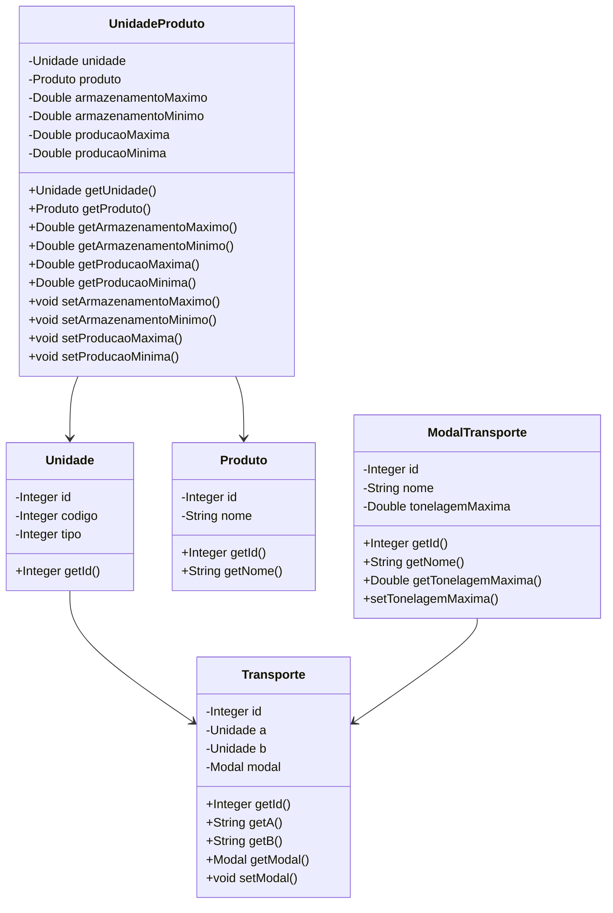

```mermaid
classDiagram
    UnidadeProduto --> Unidade
    UnidadeProduto --> Produto
    Unidade --> Transporte
    ModalTransporte --> Transporte

    %% Nó
    class Unidade {
        -Integer id
        -Integer codigo
        -Integer tipo
        +Integer getId()
    }

    class UnidadeProduto {
        -Unidade unidade
        -Produto produto
        -Double armazenamentoMaximo
        -Double armazenamentoMinimo
        -Double producaoMaxima
        -Double producaoMinima
        +Unidade getUnidade()
        +Produto getProduto()
        +Double getArmazenamentoMaximo()
        +Double getArmazenamentoMinimo()
        +Double getProducaoMaxima()
        +Double getProducaoMinima()
        +void setArmazenamentoMaximo()
        +void setArmazenamentoMinimo()
        +void setProducaoMaxima()
        +void setProducaoMinima()
    }

    class Produto {
        -Integer id
        -String nome
        +Integer getId()
        +String getNome()
    }

    %% Aresta
    class Transporte {
        -Integer id
        -Unidade a
        -Unidade b
        -Modal modal
        +Integer getId()
        +String getA()
        +String getB()
        +Modal getModal()
        +void setModal()
    }

    class ModalTransporte {
        -Integer id
        -String nome
        -Double tonelagemMaxima
        +Integer getId()
        +String getNome()
        +Double getTonelagemMaxima()
        +setTonelagemMaxima()
    }
```