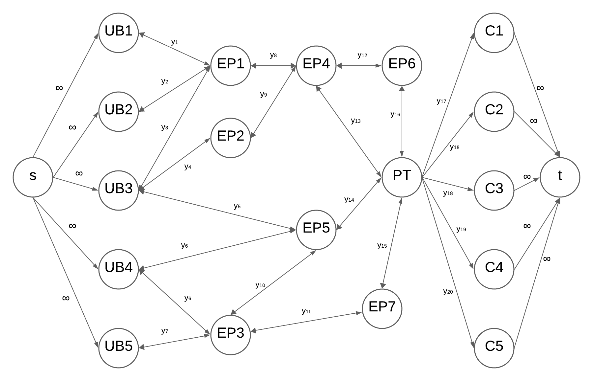
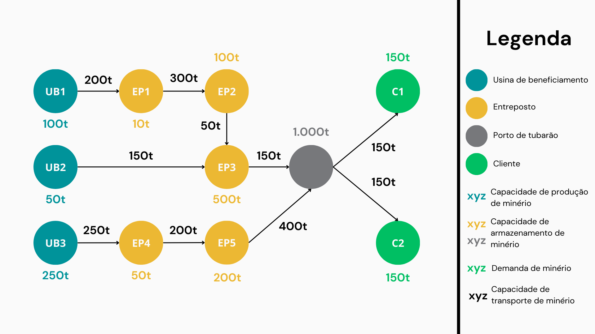

# Entendimento do contexto do problema: modelagem e representação

&emsp;&emsp;Antes de iniciar a implementação propriamente dita da solução que será entregue à Vale, é necessário pensar na modelagem matemática do problema. Considerando que o enfoque deste projeto consiste na utilização de grafos, este documento trará informações relativas à tomada de decisão, ao objetivo bem como das limitações do problema proposto. Inicialmente, a modelagem aqui será mais fraca pois nem todos os dados foram disponibilizados.

## 1. Modelagem Matemática

&emsp;&emsp;Antecipadamente a qualquer linguajar matemático, é preciso contextualizar o problema em alto nível. A Vale procurou o Inteli com a intenção de construir uma solução para planejar o fluxo de minérios em cada ponto da malha de transporte. Aqui, o principal objetivo, é maximizar o atendimento de minério de ferro dos clientes da Vale utilizando uma modelagem em grafos. Para tal, serão analisados dados referentes a:

- Especificação dos portos, usinas, modais (navios, trens, caminhões) a serem considerados no Sistema Sudeste
- Especificação dos clientes
- Capacidade de produção de cada usina de beneficiamento e cada mina
- Dados de Canais de Distribuição entre as usinas e os clientes.
- Modais de transporte disponíveis, com suas capacidades e custos
- Malha logística disponível para cada modal de transporte
- Demanda dos clientes
- Arquivo XML contendo as informações anteriormente mencionadas

&emsp;&emsp;Para resolver este problema, não basta saber somente o objetivo, alguns outros pontos também são cruciais. Um deles é entender como funcionam as Usinas de Beneficiamento, que são áreas responsáveis pela mineração e expedição dos minérios que serão entregues para os clientes. Estas usinas possuem uma característica intrínseca que consiste no fato de que, tudo aquilo que foi produzido deve ser expedido, haja vista que a produção não pode parar. Isso, juntamente com as demais informações, serão apresentadas de maneira matemática em tópicos posteriores.

&emsp;&emsp;Antes de partir para a abordagem matemática, é importante observar a imagem abaixo, a qual servirá como base para entender as explicações que se seguem.

 

Nesa imagem, tem-se que:
- $s$ é uma superfonte;
- $UBx$ é uma usina de beneficiamento $x$;
- $EPx$ é um entreposto $x$;
- $Cx$ é um cliente $x$;
- $PT$ é o Porto e Tubarão
- $\infty$ indica uma capacidade de fluxo infinito
- $y_x$ indica a capacidade máxima de fluxo naquela aresta
- $t$ é um sumidouro

### 1.1. Variáveis de decisão

&emsp;&emsp;Os dados relativos à tomada de decisão são tratados, matematicamente, como **variáveis de decisão**. Em um momento posterior, com uma abordagem computacional, essas variáveis podem ser entendedidas como incógnitas do problema de otimização. Para o caso da Vale, é possível mensurar uma variável que diz respeito ao fluxo de minérios:

- $X_{ij} =$ Fluxo de minérios (em toneladas) que passa entre os nós i e j;

### 1.2. Função objetivo

&emsp;&emsp;Para se referir matematicamente ao objetivo, existe a **função objetivo**. É ela que define e quantifica o objetivo que deseja-se alcançar e que, neste caso, é maximizar fluxo de minérios. Tendo isso em vista, juntamente com as variáveis anteriores, é possível montar uma função como descrita abaixo:

$$
\boxed{max ~~  f = \sum X_{si} }
$$

&emsp;&emsp;Essa função indica que o objetivo é maximizar o fluxo que parte da superfonte $s$ e vai até um nó $i$ qualquer. Ainda que a capacidade das arestas que partem de $s$ seja infinita, esse somatório não será infinito pois existirão as restrições de capacidade nas arestas que se seguem.

### 1.3. Restrições

&emsp;&emsp;Por fim, no que tange às limitações do problema, têm-se as **restrições**. Como o próprio nome sugere, elas impões limites e/ou restrigem características do problema e podem se manifestar tanto nos nós quanto nas arestas. Considerando que os dados finais do case da Vale não estão disponíveis, as restrições abaixo são genéricas, mas terão um maior rigor em um momento futuro quando o dados forem diponibilizados.

**Restrição de conservação**

&emsp;&emsp;Considerando uma superfonte $s$ e um sumidouro $t$, em qualquer nó $k$ que não seja nem $s$ e nem $t$, a soma de todo o fluxo que entra nele deve ser igual a soma de todo o fluxo que sai dele, isto é:

$$
\boxed{\sum_{i} X_{ik} = \sum_{j} X_{kj} \quad \forall k \neq s, k \neq t}
$$

**Restrição de escoamento da capacidade produtiva**

&emsp;&emsp;Seja $P_i$ a capacidade de produção de minério em uma **usina de beneficiamento** $i$, e seja $X_{ij}$ o fluxo de minério do nó $i$ para o nó $j$. Por fim, seja ainda $A_i$ o conjunto de todos os nós $j$ para os quais existe uma aresta partindo de $i$. Assim,

$$\boxed{P_i =  \sum_{j \in A_i} X_{ij}} $$

&emsp;&emsp;É importante notar que este sinal de igualdade implica que **TUDO** aquilo produzido em um nó deve ser escoado. Não existe a possibilidade do escoamento ser menor pois as usinas de beneficiamento (nós que produzem minério) não podem parar a sua produção. Na mesma linha de raciocínio, é impossível escoar mais minério do que foi produzido.

**Restrição de atendimento de demanda**

&emsp;&emsp;Seja $D_i$ a quantidade de minério que deve chegar até um **cliente** $i$, e seja $X_{ji}$ o fluxo de minério do nó $j$ para o nó $i$. Por fim, seja ainda $A_j$ o conjunto de todos os nós $j$ para os quais existe uma aresta chegando até $i$. Assim,

$$\boxed{D_i =  \sum_{j \in A_j} X_{ji}} $$

&emsp;&emsp;Em uma linguagem de mais alto nível, e de maneira análoga à restrição anterior, o sinal de igualdade obriga que toda a demanda solicitada pelo cliente seja atendida. Não existe nenhuma hipótese na qual o fluxo de minério pode exceder ou ser inferior ao requerido.

**Restrição de capacidade de fluxo**

&emsp;&emsp;Sendo $X_{ij}$ o fluxo de minérios (em toneladas) que partem de $i$ para $j$, e sendo $C_{ij}$ uma quantidade qualquer (em toneladas) que representa a quantidade máxima de minério que pode fluir entre estes dois pontos, têm-se:

$$\boxed{0 \leq X_{ij} \leq C_{ij} \quad \forall (i, j) \in A
}$$

&emsp;&emsp;Para esta situação, $A$ é o conjunto de todos as arestas do grafo.

## 2. Explorando um cenário

&emsp;&emsp;A seção anterior focou muito no campo das notações teóricas. O intuito deste tópico é simular um exemplo, ainda que não corresponda a realidade, do fluxo de minérios que ocorrerá com a Vale. Para iniciar esta explicação, é necessário, primeiro, observar a imagem abaixo. Nela existem nós que produzem e nós que armazenam, além das das arestas que os ligam. Todos estão representados com a sua capacidade de armazenamento e produção, conforme indicado na legenda.

&emsp;&emsp;Para este exemplo, é possível observar que há uma demanda de $300t$ a ser atendida, bem como uma produção de $400t$ para ser escoada. Uma possível solução seria:

- Da UB1 para o EP1 partem $100t$;
- Da EP1 para o EP2 partem $100t$;
- No EP2 ficam armazenadas $50t$ e $50t$ partem para EP3;
- Da UB2 para o EP3 partem $50t$;
- Do EP3 partem $100t$ (sendo $50t$ proveniente da UB2 e $50t$ psroveniente do EP2) para o Porto de Tubarão;
- Na EP4 ficam armazenadas $50t$ e partem $200t$ para EP5;
- Do EP5 partem $200t$ para o Porto de Tubarão.
- Do Porto de Tubarão partem duas cargas de $150t$, sendo uma para $C1$ e outra para $C2$.

&emsp;&emsp;É importante lembrar que essa definição foi feita manualmente pois este é um cenário pequeno. Contudo, ao considerar o cenário real da Vale, seria muito trabalhoso, senão impossível, determinar uma rota de maneira manual. Nesse sentido, a modelagem matemática que foi esboçada anteriormente servirá como base para que o algoritmo implementado pelo grupo otimize o fluxo de minérios.

## 3. Explorando algoritmos

&emsp;&emsp;Agora que já foi indicado que este é um problema de fluxo máximo, faz-se necessário escolher qual algoritmo será utilizado para abordar este problema computacionalmente. Aqui, este grupo abordará três deste algoritmos, sendo eles:

- Algoritmo de Ford-Fulkerson;
- Algoritmo de Edmonds-Karp;
- Algoritmo de Dinic.

### 3.1 Algoritmo de Ford-Fulkerson

&emsp;&emsp;O algoritmo de Ford-Fulkerson é um clássico para problemas de fluxo máximo. Como já é de se imaginar, com ele é possível encontrar o maior fluxo o qual pode ser enviado de uma origem até um sumidouro. Ele se baseia na ideia de achar caminhos de aumento, que consistem em um caminho do grafo no qual a capacidade das arestas é maior do que o fluxo atual. Isso se repete até que não seja possível mais encontrar nenhum caminho de aumento. A tabela abaixo apresenta as principais vantagens e desvantagens:

<bold>Tabela 01:</bold> Vantagens e desvantagens do algoritmo de Ford-Fulkerson

| Vantagens | Desvantagens |
|---|---|
| Algoritmo fundamental | Peca em redes densas e/ou grandes |
| Fácil implementação | Dependência da escolha dos caminhos |
| Eficiente em redes pequenas e médias | Possibilidade de loop infinito |
| Aplicabilidade ampla | Não determinístico |

&emsp;&emsp;Dentre as vantagens, existe o fato desse algoritmo ser a base para os demais algoritmos que serão mencionados aqui e justamente por ser algo mais fundamental, ele possui uma fácil implementação de código. Para além disso, ele acaba sendo eficiente para redes que sejam de pequena ou média escala, o que faz com que ele seja aplicável para uma ampla gama de situações.

&emsp;&emsp;Em contrapartida, quando se fala em desvantagens, não pode-se deixar de mencionar que ele peca na eficiência para redes densas e/ou grandes, uma vez que o número de iterações necessárias para encontrar o fluxo máximo pode ser bem alto. Além disso, a escolha dos caminhos aumentantes impacta diretamente na eficiência do algoritmo, pois a ordem com que eles são escolhidos pode levar o algoritmo a não encontrar uma solução ótima e de maneira rápida. Se pensarmos no algoritmo de maneira "pura" (ou seja, sem variações), este algoritmo também pode levar a loops infinitos quando as capacidades forem fracionárias. Por fim, a entrada de dados para este algoritmo afeta muito a sua performance devido à sua dependência em escolhas não determinísticas de caminhos aumentantes.

### 3.2 Algoritmo de Edmonds-Karp

&emsp;&emsp;Dando sequência à lista de algoritmos, existe também o algoritmo de Edmonds-Karp, que consiste em uma implementação específica do algoritmo de Ford-Fulkerson. A diferença reside no fato de que, aqui, a escolha dos caminhos aumentantes é feita utilizando a busca em largura, o que permite que os caminhos encontrados sejam sempre o de menor número de arestas, evitando problemas de ciclos infinitos e garantindo uma complexidade de tempo polinomial. Mais uma vez, têm-se uma tabela com as principais vantagens e desvantagens:

<b>Tabela 02:</b> Vantagens e desvantagens do algoritmo de Edmonds-Karp

| Vantagens | Desvantagens |
|---|---|
| Terminação garantida | Peca em redes densas |
| Fácil implementação | Sobrecarga em redes grandes |
| Complexidade conhecida | Dependência da estrutura dos dados |

&emsp;&emsp;Agora já é possível pensar em algumas vantagens desse algoritmo se comparado ao de Ford-Fulkerson. A primeira delas é a terminação garantida em tempo **finito**, ou seja, mesmo que algumas capacidades sejam fracionárias, o algoritmo terminará, justamente pelo fato de selecionar os caminhos aumentantes com o menor número de arestas. Ainda que ele seja uma variação do algoritmo de Ford-Fulkerson, ele também possui uma fácil implementação e, por fim, a complexidade de tempo do algoritmo é conhecida e consiste em $O(V E^2)$, sendo $V$ o número de vértices e $E$ o número de arestas.

&emsp;&emsp;Por outro lado, esse algoritmo também não é perfeito. Embora ele possa ser usado em redes mais maiores e, principalmente densas, ele acaba sendo pouco eficiente nestes casos. E ainda existe o fato de que esse algoritmo é sensível à forma como a rede foi representada (pois utiliza busca em largura) e, apesar da complexidade de tempo teórica fornecer um norte sobre o tempo de execução desse algoritmo, na prática, ele depende, mais uma vez, de como foi feita a distribuição e organização dos vértices e capacidades das arestas.

### 3.3 Algoritmo de Dinic

&emsp;&emsp;Por fim, falaremos sobre o algoritmo de Dinic, que também é uma variação do algoritmo de Ford-Fulkerson. Ele funciona a partir da construção de grafos de níveis utilizando a busca em largura, mas acrescenta-se a busca em profundidade para encontrar os blocos de fluxo ao longo dos caminhos aumentantes no grafo de níveis. Esse processo se repete até que não seja mais possível aumentar o fluxo. E, como é de se imaginar, ele é melhor do que o Ford-Fulkerson, até mesmo para redes densas. A tabela a seguir mostra algumas das vantagens e desvantagens.

<b>Tabela 03:</b> Vantagens e desvantagens do algoritmo de Dinic

| Vantagens | Desvantagens |
|---|---|
| Eficiência em redes densas e/ou grandes | Implementação complexa |
| Complexidade favorável | Desempenho variável |
| Adaptável | Dependência da estrutura dos dados |

&emsp;&emsp;A principal coisa que deve-se falar no que tange às vantagens, é que este algoritmo lida melhor com redes densas e/ou grandes do que os outros dois vistos até agora, já que utiliza uma abordagem em camadas e utilização de blocos de fluxo, isso é até observado na complexidade de tempo, que pode alcançar resultados significamente melhores que o algoritmo de Edmonds-Karp, por exemplo. Além disso, esse algoritmo é bem adaptável para atender a vários problemas de fluxo máximo, inclusive se tivermos mais de uma fonte e/ou sumidouro.

&emsp;&emsp;Porém, infelizmente, existem desvantagens também para este algoritmo, e a primeira delas reside no fato de que a implementação do código dele é um pouco mais complexa do que os outros dois, pois a abordagem mais completa e complexa do algoritmo dificulta a sua implementação e está mais suscetível a uma codificação incorreta. Finalmente, o desempenho dele pode variar de acordo a estrutura específica da rede, bem como a sua eficiência que está ligada à forma como os dados foram estruturados, assim como em Edmonds-Karp.

### 3.4 A escolha

&emsp;&emsp;Depois de revisar estes algoritmos é totalmente compreensível pensar: qual escolher? Bom, enquanto cientistas da computação, um primeiro passo é entender o comportamento e funcionamento destes algoritmos. Para isso, este o grupo implementará tanto o algoritmo de Ford-Fulkerson quanto o de Edmonds-Karp e analisar o resultado. Depois disso, também implementaremos algumas modificações que considerarmos importantes para o contexto específico do problema da Vale. 

## Referências

DIESTEL, R. Graph Theory. Hamburgo - Alemanha: Springer, 19 de julho de 2020. 
