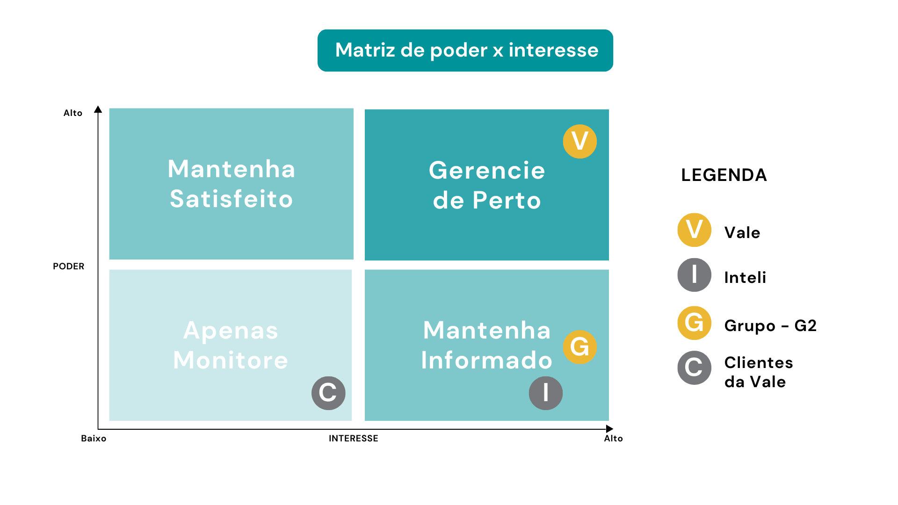
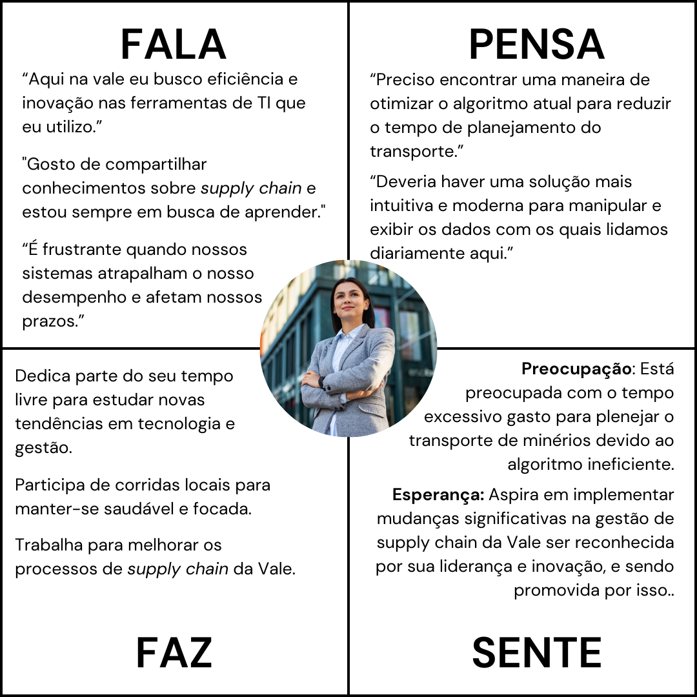
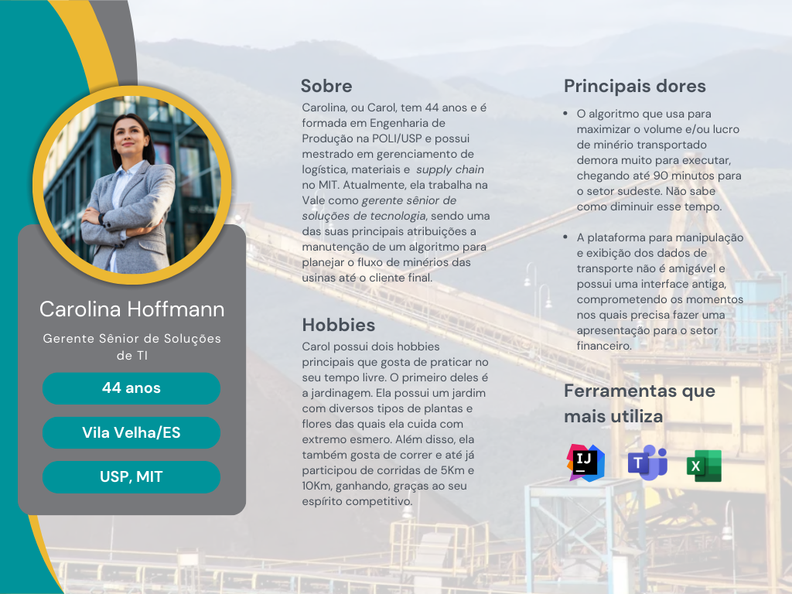

# Entendimento da experiência do usuário

&emsp;&emsp;Neste documento serão abordados os resultados da pesquisa no que tange à experiência do usuário da Vale, dando destaque para os colaborarem que estão diretamente ligados com o projeto a ser desenvolvido. Aqui, serão exibidos serão apresentandos dois conceitos: personas e User Stories.

## 1. Personas

&emsp;&emsp;As personas são uma representação fictícia sobre um determinado nicho. Elas são fundamentais quando se está desenvolvendo uma nova solução, pois permitem entender o perfil de determinado grupo de pessoas, fornecendo um melhor entendimento das suas necessidades para que seja possível construir uma solução que melhor atenda às demandas. Neste grupo, o mapeamento das personas iniciou com o mapeamento dos _stakeholders_ do projeto. Nesse sentido, destacou-se os quatro principais, como é possível ver abaixo.

-   **Vale**: Empresa parceira para a qual este projeto está sendo desenvolvido;

-   **Clientes da Vale**: Os clientes para os quais a Vale fornecem seus serviços;

-   **Grupo - G2**: Este grupo de desenvolvedores, que participará ativamente na construção da solução;

-   **Inteli**: Esta faculdade, que media e acompanha o andamento do projeto.

&emsp;&emsp;Uma vez identificadas as principais partes interessadas no negócio, é necessário definir qual(ais) grupo(s) serão representados nas personas, pois elas guiarão o trabalho deste grupo. Uma ferramenta que ajuda nessa tomada de decisão é a matriz de interesse e poder. Como o nome sugere, ela é uma matriz dividida que classifica os _stakeholders_ em grupos de acordo com os níveis de interesse e poder que eles exercem sobre o projeto. Dessa forma, este grupo manejou as entidades mencionadas anteriormente como é possível ver na imagem abaixo.

&emsp;&emsp;Neste tipo de matriz, os interessados são divididos em 4 grupos e, para o projeto junto à Vale, os _stakeholders_ foram assim categorizados:

-   **Vale**: Alto poder e alto interesse: Considerando que o projeto está sendo desenvolvido para resolver a um problema da própria Vale, é incostestável o seu interesse, ao mesmo passo em que o seu nível de poder é altíssimo, haja vista que ele intervirá a todo momento para garantir que suas dores estão sendo, quando menos, atenuadas;

-   **Inteli**: Baixo poder e alto interesse: Ainda que a faculdade tenha um enorme interesse no desenvolvimento do projeto, o seu poder é baixo, haja vista que a instituição haje mais no sentido de intermediar e oferecer a parceria entre alunos - empresas;

-   **Grupo - G2**: Baixo/médio poder e alto interesse: A construção desta solução é de grande interesse para o grupo, haja vista a oportunidade de aprendizado e a vontade de ver o cliente utilizando algo produzido por estes desenvolvedores. Contudo, o poder é elencado como baixo/médio, uma vez que, ainda que o grupo possa optar pela forma como vai modelar o problema matematicamente, representá-lo de maneira visual, etc., as decisões finais acabam recaindo sobre o parceiro (Vale).

-   **Clientes - Vale**: Baixo poder e médio interesse: Embora os clientes finais não tenham controle algum sobre as decisões referentes ao projeto, eles possuem um certo interesse, haja vista que irão beneficiar-se com a implementação da solução. Este interesse, no entanto, não é maior pois eles sequer utilizarão a solução.

&emsp;&emsp;Um _insight_ interessante fornecido pela matriz de interesse e poder é quem deve ser mapeado como persona. E como já é possível imaginar, a entidade deve ser aquela que está na região do "gerencie de perto". É por isso que, neste caso, as personas serão colaboradores da Vale.

&emsp;&emsp;Nada obstante o público alvo a ser mapeado tenha sido restrito, existem vários tipos, cargos e níveis de colaboradores na Vale. Logo, é necessário afunilar ainda mais quem representerá as personas. A definição deste filtro aconteceu em validações junto ao parceiro, o qual indicou quem utilizará a solução.

&emsp;&emsp;Assim, este grupo concentrará as características do público alvo em única persona, a Carolina. Antes de inserir a Carol em um template, esta equipe preocupou-se em criar um mapa de empatia da Carol, que fornecerá mais embasamento para descrever a persona. Ele pode ser visto abaixo.

&emsp;&emsp;Com isso, finalmente é possível dar um corpo para a Carolina, ou simplesmente Carol, como gosta de ser chamada. Ela tem 44 anos e possui bacharelado em Engenharia de Produção na Escola Politécnica da Universidade de São Paulo (POLI/USP), além de mestrado em logística de materiais e _supply chain_ pelo _Massachusetts Institute of Technology_ (MIT) e trabalha como gerente de soluções de tecnologia na Vale. Outras informações relevantes sobre a Carol podem ser consultadas no template que segue.

&emsp;&emsp;É importante mensurar que as informações anteriormente elencadas foram ratificadas em pesquisas realizadas no perfil dos colaboradores da Vale no LinkedIn, bem como em conversa com o parceiro.

## 2. User Stories

&emsp;&emsp;As User Stories são uma prática essencial na metodologia ágil, focadas em compreender as necessidades e expectativas dos usuários finais em relação ao desenvolvimento de um produto ou serviço. Elas são formuladas de maneira simples e direta, descrevendo as funcionalidades e características desejadas de forma concisa, proporcionando uma compreensão clara das expectativas do usuário. Amplamente utilizadas em projetos ágeis, as User Stories asseguram que o desenvolvimento esteja alinhado com as reais necessidades dos usuários, agregando valor e satisfação.

&emsp;&emsp;O método INVEST é uma abordagem adotada para criar User Stories eficazes, representando um acrônimo que engloba seis critérios fundamentais: Independente, Negociável, Valiosa, Estimável, de Tamanho apropriado e Testável. Seguir esses critérios permite que as equipes desenvolvam histórias mais claras, objetivas e compreensíveis, contribuindo significativamente para o sucesso do projeto.

&emsp;&emsp;No contexto da Vale SA, uma das maiores mineradoras do mundo, as User Stories foram elaboradas com base nas necessidades e expectativas da persona Carolina, gerente sênior de soluções de tecnologia da empresa (seção 1.0). A partir de uma análise detalhada do perfil e das demandas da persona, foram identificadas as principais funcionalidades e características desejadas para a solução a ser desenvolvida, resultando na criação de User Stories que refletem as reais necessidades dos usuários finais.

### 2.1 User Stories: Carolina Hoffmann

1. Como gerente de soluções de tecnologia na Vale, quero um sistema que tenha um tempo de execução rápido, para que eu possa otimizar o tempo de processamento de dados e obter resultados mais eficientes.
2. Como gerente de soluções de tecnologia na Vale, quero um sistema que possua uma interface intuitiva e amigável, para que eu possa utilizar a solução de forma simples e prática.
3. Como gerente de soluções tecnológicas na Vale, desejo que o sistema seja capaz de simular diversos cenários logísticos com base em dados variáveis. Isso nos permitirá antecipar e nos preparar para uma ampla gama de situações operacionais, assegurando a resposta mais eficaz às necessidades dos clientes.
4. Como gerente de soluções tecnológicas na Vale, quero pode exportar os resultados em CSV para poder carregar os dados com outros sistemas (legado ou não) da empresa. Isso nos permitira usufruir dos benefícios do novo sistema sem precisar refazer tudo o que já temos funcionando.
5. Como gerente de soluções tecnológicas na Vale, quero pode importar os parâmetros em CSV para poder utilizar dados oriundos de outros sistemas utilizados na empresa (por exemplo, SAP). Isso nos permitira acelerar o input de dados no novo script, usufruindo dos benefícios do novo sistema de forma mais rápida (potencialmente de forma automatizada pela nossa equipe interna de TI), sem precisar refazer tudo o que já temos funcionando.
