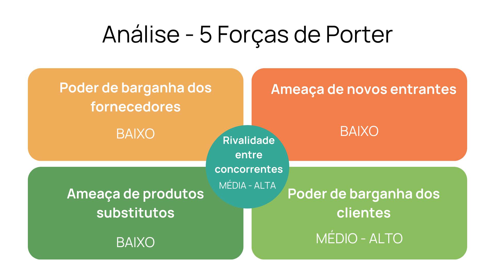

# 1.Entendimento de negócio

&emsp;&emsp;Esse documento se trata da análise feita pelo grupo para entender e planejar a solução a ser desenvolvida, abrangindo, assim, a compreensão do mercado e do negócio da empresa parceira, a definição dos riscos e da visão geral do projeto.

### Contexto da indústria
&emsp;&emsp;A indústria de mineração é um dos setores fundamentais da economia global, fornecendo matérias-primas essenciais para uma variedade de indústrias, incluindo construção, manufatura, tecnologia e energia. Esta indústria extrai minerais da terra, que são cruciais para a produção de tudo, desde metais usados na construção de edifícios e na fabricação de veículos, até os minerais raros utilizados em dispositivos eletrônicos e tecnologias de energia renovável. A mineração desempenha um papel vital não apenas na economia, mas também no desenvolvimento tecnológico e na transição para energias mais sustentáveis.

&emsp;&emsp;Contudo, a indústria de mineração enfrenta desafios significativos relacionados ao impacto ambiental, questões sociais e a necessidade de práticas sustentáveis. A exploração de recursos naturais tem sido associada a problemas como desmatamento, perda de biodiversidade, poluição da água e do ar, além de questões sociais que incluem o deslocamento de comunidades e condições de trabalho precárias. Diante desses desafios, a indústria tem buscado inovar em métodos de mineração mais eficientes e menos danosos ao meio ambiente, além de adotar políticas de responsabilidade social e ambiental para mitigar os impactos negativos e promover o desenvolvimento sustentável.

&emsp;&emsp;Nesse contexto, a Vale(Vale S.A,2023) é a segunda maior mineradora diversificada do mundo, uma das 30 maiores companhias públicas negociadas no mundo e a maior empresa privada na América Latina. Tendo uma capitalização de mercado de aproximadamente US$ 40 bilhões, com cerca de 500.000 acionistas em todos os continentes. 

&emsp;&emsp;De acordo com o Boston Consulting Group(BCG), uma das empresas líder de consultoria no mundo, a Vale foi escolhida como uma das 25 maiores geradoras de valor sustentável aos acionistas no mundo, devido ao seu extraordinário desempenho ao longo dos últimos 10 anos. 

&emsp;&emsp;A base do seu sucesso ocorre pelo fato de ser a maior produtora mundial de minério de ferro(Valor Econômico), matéria-prima essencial para a indústria siderúrgica, e a segunda maior produtora de níquel, com aplicações na indústria de aço inoxidável, aeronaves, telefones celulares, baterias, baterias especiais para veículos elétricos híbridos, entre outras. A Vale também produz manganês, ferro ligas, carvão térmico e metalúrgico, bauxita, alumina, alumínio, cobre, cobalto, metais do grupo da platina e fertilizantes, matérias primas importantes para a indústria e a agricultura global.

&emsp;&emsp;Atualmente ela é a empresa que mais investe em logística no Brasil. Ao longo dos anos, ela tem realizado pesados investimentos para ampliar a capacidade de atender às demandas, contribuindo para o crescimento do país e das exportações brasileiras. A empresa possui uma infraestrutura privilegiada, que permite a conexão das principais regiões produtoras aos portos, viabilizando o escoamento de cargas. Com isso, seus investimentos tem foco no aumento da produtividade das ferrovias e portos e na garantia da eficiência e segurança das operações e das comunidades que vivem sobre a sua área de influência. 

### Cinco forças de Porter

&emsp;&emsp;As Cinco Forças de Porter(PROMAD JR,2021), desenvolvidas por Michael E. Porter, são uma ferramenta essencial na análise da competitividade de um setor. Essa metodologia oferece uma estrutura robusta para compreender as forças que moldam a dinâmica competitiva e o potencial de lucratividade de um negócio. Ao examinar aspectos como poder dos fornecedores, ameaça de novos entrantes e rivalidade entre concorrentes, as Cinco Forças proporcionam uma visão estratégica valiosa para orientar decisões informadas.

    Figura 1 - 5 forças de Porter
    
    Fonte: Material produzido pelos autores (2024)

#### Poder de barganha dos fornecedores

&emsp;&emsp;O poder de barganha dos fornecedores no setor de mineração, no caso da Vale, é relativamente baixo devido à grande escala de operações da empresa e à sua capacidade de influenciar as condições de compra. Como uma das maiores mineradoras do mundo, a Vale tem acesso a uma ampla rede de fornecedores globais para equipamentos de mineração, serviços e outros insumos necessários para suas operações. Isso permite à Vale negociar melhores preços e termos devido ao volume significativo de seus pedidos e à capacidade de trocar fornecedores se necessário.

&emsp;&emsp;Além disso, a empresa investe em tecnologia e otimização da cadeia de suprimentos para aumentar a eficiência e reduzir a dependência de fornecedores externos. A Vale também pode ter parcerias estratégicas e contratos de longo prazo que asseguram a continuidade e a estabilidade do fornecimento, diminuindo ainda mais o poder individual de qualquer fornecedor. Portanto, a Vale mantém uma posição robusta em relação aos seus fornecedores, assegurando que sua influência nas operações da empresa seja moderada.

#### Poder de barganha dos clientes

&emsp;&emsp;O poder de barganha dos clientes da Vale é alto, principalmente devido ao seu papel como grandes consumidores de minério de ferro na indústria siderúrgica. Compradores como os fabricantes de aço, especialmente em países como a China, têm influência significativa nas negociações devido aos grandes volumes que adquirem, podendo exercer pressão sobre os preços e as condições de contrato. Essa dinâmica é reforçada em cenários de excesso de oferta ou redução da demanda, onde os clientes podem forçar uma competição mais acirrada entre fornecedores.

&emsp;&emsp;No entanto, a dependência de minério de ferro de alta qualidade e a posição da Vale como um dos líderes globais na sua produção conferem à empresa uma certa vantagem nas negociações. A Vale pode utilizar sua influência e a diversificação de seus mercados para mitigar o poder de barganha dos clientes. A estratégia de diversificação de clientes, a expansão para novos mercados e a manutenção da qualidade do produto são abordagens que ajudam a empresa a manter um equilíbrio mais favorável em suas relações comerciais

#### Ameaça de novos entrantes

&emsp;&emsp;A ameaça de novos entrantes no setor de mineração é considerada baixa, principalmente devido a barreiras substanciais como alto capital inicial necessário, regulamentações rigorosas, acesso limitado a recursos minerais de qualidade e a necessidade de expertise técnica especializada. Esses fatores juntos criam um ambiente desafiador para novas empresas que desejam entrar no mercado, com grandes mineradoras já estabelecidas desfrutando de vantagens significativas, como economias de escala e controle sobre as melhores reservas.

&emsp;&emsp;No entanto, a entrada de novos competidores não é totalmente impossível, especialmente para aqueles com acesso significativo a recursos financeiros e tecnologias inovadoras que podem desafiar o status quo. Avanços tecnológicos, por exemplo, podem reduzir custos operacionais ou viabilizar a exploração de reservas anteriormente inacessíveis. Por isso, as empresas estabelecidas devem permanecer vigilantes, investindo continuamente em inovação e estratégias eficazes, como integração vertical e parcerias estratégicas, para manter sua vantagem competitiva e se proteger contra potenciais novos entrantes que buscam superar as barreiras existentes

#### Rivalidade entre concorrentes

&emsp;&emsp;No mercado internacional, a Vale compete com grandes mineradoras como Rio Tinto, BHP e FMG Fortescue (Toro blog,2023), que têm operações significativas e distribuem seus produtos globalmente. A rivalidade é acirrada devido à concorrência direta por mercados importantes e pela pressão para manter a eficiência operacional e os preços competitivos. As empresas buscam diferenciar-se pela qualidade do produto, custos de produção, inovações tecnológicas e práticas sustentáveis. A Vale, com sua posição como líder em produção de minério de ferro, precisa manter a inovação e a eficiência para competir nesse ambiente de alta competição.

&emsp;&emsp;No mercado nacional, a Vale e a CSN (Infomoney,2013) operam em condições diferentes. Embora a CSN seja uma competidora significativa no Brasil, as limitações logísticas internas, como a dependência de ferrovias e portos eficientes, podem restringir sua capacidade de distribuir produtos e competir em igualdade de condições com a Vale. A Vale, com sua infraestrutura logística mais desenvolvida, tem uma vantagem competitiva que lhe permite atender tanto ao mercado interno quanto ao exportador de maneira mais eficaz. No entanto, a Vale deve permanecer atenta às mudanças no mercado interno e às estratégias dos concorrentes locais para assegurar sua posição.

#### Ameaça de produtos substitutos

&emsp;&emsp;A ameaça de produtos substitutos para os principais produtos da Vale, como minério de ferro, níquel e cobre, é geralmente considerada baixa, devido à natureza essencial desses metais em diversas aplicações industriais e tecnológicas. O minério de ferro, por exemplo, é fundamental na produção de aço, um material indispensável na construção civil, fabricação de automóveis e em infraestruturas diversas. Embora existam pesquisas em andamento para encontrar materiais mais sustentáveis ou eficientes, o aço continua sendo insubstituível em muitas de suas aplicações devido à sua força, durabilidade e custo-benefício.

&emsp;&emsp;Similarmente, o níquel e o cobre são metais com propriedades únicas que os tornam valiosos em várias indústrias. O níquel é crucial na fabricação de baterias recarregáveis, especialmente para veículos elétricos, onde sua capacidade de armazenamento de energia é inigualável por alternativas atuais. O cobre é amplamente utilizado na eletrônica e na construção, especialmente em fiação elétrica, devido à sua excelente condutividade elétrica. Enquanto materiais alternativos, como alumínio, podem substituir o cobre em algumas aplicações devido à sua leveza e condutividade, o cobre ainda é preferido onde a eficiência e a durabilidade são críticas. Dessa forma, enquanto a inovação contínua pode eventualmente apresentar substitutos viáveis, a posição dominante do minério de ferro, níquel e cobre em suas respectivas aplicações permanece relativamente segura no curto a médio prazo, limitando a ameaça de produtos substitutos

## 2 Análise Swot 
&nbsp;&nbsp;&nbsp;&nbsp;A análise SWOT avalia a empresa em relação ao mercado de maneira geral. Para isso, são analisados fatores referentes aos ambientes interno e externo do negócio, ou seja, o que está dentro da esfera de controle da empresa e o que não está. Portanto, são avaliadas no ambiente interno “Strengths” (“Forças”; características que trazem um diferencial em relação aos concorrentes e podem influenciar positivamente) e “Weaknesses” (“Fraquezas”; elementos que, por não serem pontos fortes da empresa, fornecem algum tipo de vantagem aos competidores e podem influenciar negativamente), enquanto no ambiente externo são analisadas “Opportunities” (“Oportunidades”; dizem respeito a possibilidades de obter melhores resultados, maior lucratividade ou crescer por causa de conjunturas externas favoráveis) e “Threats” (“Ameaças”; referem-se aos cenários externos desfavoráveis que colocam em risco o desenvolvimento ou a permanência da empresa no mercado).

&nbsp;&nbsp;&nbsp;&nbsp;A seguir, na figura 02, demonstra-se a matriz SWOT construída pelo grupo Amigos da Katsuki em relação à Vale.

    Figura 2 - Matriz SWOT
    
    Fonte: Material produzido pelos autores (2024)

Figura X - Matriz SWOT
!(Análise swot)[./assets/AnáliseSwotG2.png]

&nbsp;&nbsp;&nbsp;&nbsp;Na sequência, são justificados e detalhados os pontos supracitados na imagem, a fim de explanar a análise feita pelo grupo acerca da Vale.

### Forças
**Rede de transporte e distribuição eficiente:** A Vale possui uma ampla rede de transporte e distribuição eficiente, possuindo diferentes tipos de modais de transporte, que permite a rápida movimentação de seus produtos minerais para os mercados globais. Essa eficiência logística é uma força significativa, garantindo que a empresa possa atender à demanda mundial de maneira oportuna e eficaz.

**Diversificação geográfica:** A diversificação geográfica é uma força estratégica da Vale, pois a empresa possui operações em diversas regiões do mundo. Isso não apenas reduz a exposição a riscos específicos de determinadas localidades, como dependências em mercados, flutuações na demanda e crises polítcas, mas também permite que a Vale capitalize oportunidades em diferentes mercados, adaptando-se às condições específicas de cada região.

**Boa gestão financeira:** A Vale demonstra uma gestão financeira sólida, refletida em sua capacidade de tomar decisões estratégicas de alocação de recursos, realizar investimentos significativos em projetos de longo prazo e enfrentar desafios econômicos com resiliência. Essa estabilidade financeira não apenas sustenta as operações da empresa, mas também contribui para a confiança dos investidores e stakeholders, fortalecendo seu posicionamento no mercado e facilitando o acesso a recursos financeiros para futuros empreendimentos e expansões.

**Atenção para políticas de ESG (Ambientais, Sociais e de Governança):** A Vale tem uma atenção significativa para as políticas de ESG, destacando seu compromisso contínuo com práticas empresariais sustentáveis. Esse foco não apenas alinha a empresa com as crescentes expectativas da sociedade em relação à responsabilidade corporativa, mas também demonstra seu comprometimento em mitigar os impactos ambientais e sociais associados às suas operações. Ao priorizar as considerações ambientais, sociais e de governança, a Vale não apenas fortalece sua reputação e relacionamento com as comunidades onde opera, mas também reduz os riscos relacionados a questões regulatórias, legais e reputacionais, garantindo a sustentabilidade de longo prazo de suas operações e seu papel como agente de desenvolvimento responsável.

**Vantagem competitiva  relacionada à produção de pelotas de ferro:** A Vale se destaca na produção de pelotas de ferro, aproveitando suas vantagens competitivas. Com acesso a reservas de minério de ferro de alta qualidade, a empresa utiliza tecnologia avançada para otimizar a produção e a eficiência energética, mantendo uma operação em larga escala que reduz os custos unitários. Seu compromisso com práticas sustentáveis e responsáveis fortalece sua imagem e atende às demandas regulatórias e de mercado. Através de uma rede global de distribuição e fortes relações estratégicas com clientes, a Vale assegura uma entrega eficiente e personalizada de pelotas, consolidando sua posição de liderança no mercado e protegendo-se contra a concorrência e as flutuações de mercado.

### Fraquezas
**Dependência de commodities:** A Vale enfrenta uma fraqueza significativa em sua dependência de commodities, especialmente o minério de ferro, por ser bastante volátil. Variações nos preços globais das commodities podem impactar diretamente os resultados financeiros da empresa. A falta de diversificação de produtos torna a Vale vulnerável a flutuações no mercado de commodities, sujeitando-a a riscos financeiros e econômicos.

**Dificuldade em regulamentação:** A complexidade das regulamentações governamentais e a variação nas políticas de licenciamento em diferentes jurisdições representam uma fraqueza para a Vale. A dificuldade em se adaptar rapidamente a mudanças regulatórias pode afetar a eficiência operacional e resultar em desafios adicionais para a empresa.

**Preservação Ambiental:** A Vale enfrenta desafios na área de preservação ambiental, notadamente após incidentes passados que resultaram em impactos ambientais significativos. A gestão dessas questões é crítica para a empresa, uma vez que problemas ambientais podem afetar a reputação da Vale, resultar em custos adicionais e levantar preocupações de ordem regulatória.

### Oportunidades
**Financiamento em sustentabilidade na mineração:** A crescente ênfase global em práticas sustentáveis e responsabilidade corporativa oferece à Vale a oportunidade de acessar financiamentos específicos para projetos de mineração sustentável. Ao buscar parcerias e financiamentos voltados para a sustentabilidade, a Vale pode desenvolver tecnologias mais limpas, implementar práticas mais sustentáveis e fortalecer sua posição como líder no setor.

**Expansão em novos mercados:** A Vale tem a oportunidade de expandir suas operações para novos mercados, diversificando ainda mais suas fontes de receita. Explorar regiões com demanda crescente por minerais, como países em desenvolvimento, pode proporcionar à empresa oportunidades de crescimento substanciais e reduzir a dependência de mercados específicos.

**Intensificação no interesse em minerais:** O aumento contínuo na demanda por minerais em setores como tecnologia, energia renovável e manufatura cria oportunidades para a Vale. A empresa pode explorar a crescente demanda por minerais essenciais em indústrias emergentes, como o cobalto e lítio para baterias de veículos elétricos, ampliando seu portfólio de produtos e impulsionando receitas.

### Ameaças

**Dependência do mercado exterior:** A dependência significativa da Vale em relação ao mercado externo representa uma ameaça à empresa. Flutuações nas condições econômicas globais, instabilidades geopolíticas ou mudanças nas políticas comerciais podem afetar adversamente as exportações da Vale, impactando sua receita e lucratividade.

**Concorrência de grandes empresas como BHP e Rio Tinto:**A concorrência acirrada com empresas globais, como BHP e Rio Tinto, representa uma ameaça constante para a Vale. Essas empresas são concorrentes diretos no setor de mineração e podem influenciar preços, tecnologias e participação de mercado. A necessidade de manter a competitividade global exige que a Vale continue a inovar e melhorar eficiências operacionais.

**Preço do frete:** A alto do preço do frete pode impactar negativamente a Vale, uma vez que a empresa depende de uma rede de transporte eficiente para exportar seus produtos. Assim, esses aumentos podem resultar em custos adicionais e reduzir a rentabilidade e competitividade da empresa, dificuldando seu planjemento financeiro e a sua eficiência.

## 3. Descrição da Solução
### Problema
A Vale possui dezenas de minas distribuidas por todo o território brasileiro, mas para o sistema sudeste há um único destino final: o Porto de Tubarão, no Espírito Santo. Na prática, os minérios saem de Usinas de Beneficiamento (UB), passam por diferentes Entrepostos para armazenamento, e chegam ao porto. Durante este processo, são utilizados diferentes modais (ex. navios, trens, caminhões, etc.) cada um com uma diferente capacidade, e a Vale precisa saber qual a melhor malha logística para atender a demanda de seus clientes.

### Solução Proposta
A solução proposta pelo grupo é entregar à Vale uma aplicação web que receba um arquivo CSV (Comma-Separated Valued) com as demandas dos clientes da empresa,
processe estes dados utilizando grafos e os algoritmos de Edmonds-Karp e Ford-Fulkerson, ambos relacionados à maximização do fluxo da rede, para retornar ao usuário
o fluxo de minérios, em Toneladas que deve haver entre um nó e outro para maximiar este fluxo.

### Como deve ser utilizada?
A aplição web é baseada em Spring, então deverá ser executada em qualquer computador que tenha um JRE (Java Runtime Environment) instalado. Sua utilização será feita através de um navegador de internet (como o Google Chrome), podendo ser facilmente executada por qualquer pessoa com conhecimento básico em TI.

### Benefícios
Para a Vale, o maior benefício proporcionado é um aumento na eficiência logística da malha de transportes, o que contribui para a capacidade de que a empresa tem
de suprir a demanda de seus clientes. Outros benefícios incluem o aumento da eficiência operacional, através da redução do tempo de processamento do script a ser
desenvolvido em relação à solução atual que leva aproximadamente 90 minutos para ser executada. 

A aceleração deste processo pode, futuramente, levar à redução dos custos com transporte e manutenção; isso se dá pois será possível fazer mais simulações, com diferentes
parâmetros de entrada e saída, para chegar à conclusão de qual a melhor forma da rede. Inclusive, uma evolução do entregável deste projeto, pode fazer o uso de
Simulações de Monte Carlo para prever diferentes cenários e ajudar a empresa a criar redundâncias em sua malha.

### Métricas de Sucesso
Este projeto impacta várias áreas da empresa direta e indiretamente. Este impacto pode levar anos para ser medido em sua totalidade; porém, a fim de limitar o escopo
deste projeto, propõe-se estabelecer as seguintes métricas de sucesso:
- Tempo de execução do novo script 30% abaixo do tempo de execução do script atual: medido com técnicas de Benchmarking do script;
- Resultados determinísticos: pode ser categorizado como tal através da escola dos algoritmos utilizados no projeto;
- Sobra de minério abaixo de 15% no nó final. (Esta métrica poderá ser revisada após a entrega dos dados de demanda pelo parceiro)

## 4. Value Proposition Canvas

&emsp;&emsp;O Canvas de Proposta de Valor é uma ferramenta estratégica de gestão que facilita a elaboração e delineamento de modelos de negócios, tanto novos quanto já existentes. Consiste em um esquema visual predefinido que engloba nove elementos-chave do modelo de negócios. O Value Proposition Canvas surge como uma ferramenta valiosa para criar uma Proposta de Valor distintiva no mercado. Seus principais atributos incluem a capacidade de criar uma proposta que se conecte com os clientes, a identificação de áreas de aprimoramento no negócio atual e uma maior visibilidade no mercado.

&emsp;&emsp;No contexto do projeto, o Canvas de Proposta de Valor foi empregado para identificar os principais desafios enfrentados pelos clientes e as soluções oferecidas pelo produto. Isso permitiu a identificação dos benefícios proporcionados pelo produto aos clientes, bem como destacou suas diferenciações em relação aos concorrentes. A seguir, apresenta-se o Canvas de Proposta de Valor utilizado no projeto:

<figure>
  <figcaption style="text-align: center;">Figura 3 - Canvas de Proposta de Valor</figcaption>
  
  <figcaption style="text-align: center;">Fonte: Autoria própria.</figcaption>
</figure>

### Proposição de Valor Aprimorada 
#### Produtos e Serviços:

* **Ferramenta de Otimização Logística:** A solução contempla uma ferramenta especializada em otimização dos processos logísticos da empresa, por meio do uso de grafos. A ferramenta é capaz de processar os dados fornecidos pela Vale, oferecendo planos de transporte eficientes que atendam aos requisitos dos clientes. Além disso, o programa desenvolvido é capaz de ser personalizado para atender às necessidades específicas da Vale, permitindo a empresa testar diferentes cenários e parâmetros de otimização sem a necessidade de alterar o código fonte.

#### Criadores de Ganho:

* **Aumento da Flexibilidade Operacional:** A capacidade de modelar e otimizar diferentes cenários de distribuição de minérios proporciona à Vale maior flexibilidade operacional para lidar com variações na demanda, mudanças nas condições do mercado e imprevistos operacionais.

* **Melhoria na Tomada de Decisões:** Com base no algoritmo avançado de otimização, a Vale SA pode tomar decisões mais informadas sobre suas operações logísticas, isso resulta em uma distribuição de recursos mais eficaz e num planejamento estratégico melhor alinhado com as demandas do cliente.

### Aliviadores de Dor:

* **Redução de Tempo:** Ao reduzir o tempo de execução, a proposta de valor contribui para encurtar o ciclo de operações em toda a cadeia de suprimentos, tornando os processos mais ágeis e responsivos. Além disso, possibilita à Vale testar diversos parâmetros no modelo de otimização sem a necessidade de esperar muito tempo para obter resultados.
  
* **Aumento da Eficiência da Cadeia de Suprimentos:** Uma coordenação mais eficiente de todos os elementos da cadeia de suprimentos permite um controle mais firme e assertivo, desde a produção até a entrega do produto ao cliente final. Assim, resultando em um processo mais fluido e eficiente.

* **Mitigação de Riscos de Estoque:** Uma distribuição mais precisa e eficiente ajuda a reduzir os níveis de estoque excessivo ou insuficiente, aliviando a dor dos riscos financeiros associados ao armazenamento de grandes quantidades de minério.

### Segmento de Cliente:

#### Tarefas do Cliente:

* **Planejamento da malha logística:** A Vale SA precisa planejar a distribuição dos minérios em sua malha logística, que inclui ferrovias, portos, usinas, modais de transporte, e terminais de minério. De forma que, o fluxo de minério de ferro seja maximizado para atender as demandas dos clientes.

#### Dores:

* **Demora na Execução do Programa:** Atualmente, a solução de logística da Vale tem um tempo de execução de 90 minutos. Assim, a empresa enfrenta dificuldades para lidar com variações na demanda e imprevistos operacionais.
  
* **Ineficiência Operacional:** A falta de coordenação e otimização nos processos logísticos da Vale resulta em uma baixa flexibilidade para lidar com variações na demanda e imprevistos operacionais.
  
* **Falta de Flexibilidade Operacional:** O longo tempo de execução do programa atual impede a Vale de testar diferentes cenários e parâmetros de otimização, resultando em baixa flexibilidade operacional.

#### Ganhos:

* **Redução do Tempo de Execução do Programa:** A ferramenta é capaz de reduzir significativamente o tempo de execução do programa, gerando economia de tempo no planejamento logístico da Vale.
  
* **Aumento da Eficiência Operacional:** Uma redução no tempo de espera para execução permite a otimização dos processos logísticos da Vale, resultando em maior eficiência operacional.

Em conclusão, o Value Proposition Canvas desempenhou um papel crucial na identificação e refinamento da proposição de valor do produto, permitindo uma análise profunda das necessidades dos clientes, das dores que enfrentam e dos ganhos que buscam. Através da ferramenta de otimização logística proposta, é possível abordar desafios significativos enfrentados pela Vale, como a demora na execução de programas e ineficiências operacionais, proporcionando soluções que não apenas melhoram a eficiência operacional com a maximização do fluxo de minério, mas também aumentam a flexibilidade operacional e a capacidade de resposta a imprevistos e variações de demanda. Este enfoque meticuloso em aliviar as dores dos clientes e amplificar seus ganhos destaca a força de uma proposta de valor bem desenvolvida, fundamentada em um entendimento claro das necessidades do cliente e em soluções inovadoras que atendam a essas necessidades de maneira eficaz. 

## 5. Matriz de Riscos

&emsp;&emsp;A Matriz de riscos, assim como o nome sugere, é uma ferramenta de gerenciamento de riscos que fornece, de maneira visual, a identificação sobre quais riscos relacionados ao desenvolvimento de um projeto devem ser priorizados. Ela é composta por dois eixos: um que indica a probabilidade de um risco acontecer e outra que informa o impacto que esse risco terá para o negócio caso acabe se tornando realidade. Assim, um risco com probabilidade alta e com impacto alto é algo que deveria receber muita atenção, enquanto um risco com impacto alto, mas probabilidade de acontecimento baixa, ainda deve receber atenção, mas não não possui um monitoramento tão prioritário quanto o anterior.

&emsp;&emsp;Nesse sentido, o grupo Amigos da Katsuki elaborou uma matriz com base no mapeamento dos riscos observados para o desenvolvimento da solução anteriormente mencionada. Ela pode ser observada na imagem abaixo.

<figure>
  <figcaption style="text-align: center;">Figura 4 - Matriz de Riscos</figcaption>
  
  <figcaption style="text-align: center;">Fonte: Material produzido pelos autores (2024)</figcaption>
</figure>

&emsp;&emsp;Com os tópicos elencados abaixo, é possível entender melhor os pontos levantados anteriormente, assim como os motivos que levaram eles a serem classificados em relação a impacto e probabilidade. Os pontos estão sendo lidos de cima para baixo e da esquerda para a direita, respetivamente.

- **Planning ineficientes:** Refere-se ao cenário no qual este time não consegue se planejar direito para o desenvolvimento das atividades da sprint, acarretando na sobrecarga de trabalho para alguns dos membros. A probabilidade disto acontecer é baixa, haja vista a experiência que esta equipe carrega. O impacto também é baixo já que a sobrecarga seria temporária e não impediria a não entrega dos artefatos.

- **Alta cobrança por parte dos membros:** Existe a situação em que o membro se cobra muito para a realização do projeto, levando a desgastes físicos e/ou emocionais. A probabilidade disto acontecer é muito baixa, pois nem todos possuem um estilo de trabalho "workaholic", além de que o impacto também é baixo, uma vez que o grupo irá auxiliar o membro que possivelmente chegue a este estado.

- **Atraso no autoestudo:** Caso em que os membros dos grupos atrasam os autoestudos oferecidos pelo Inteli. A probabilidade disso acontecer é muito alta, pois o curso de Ciência da Computação é conhecido por ser intenso na quantidade de material disponibilizado para estudo. Já o impacto é moderado pois, dependendo da quantidade de conteúdo acumulado, talvez nem seja possível continuar com o desenvolvimento da solução.

- **Dificuldades decorrentes de problemas pessoais:** É sabido que a vida é cercada por imprevistos, em especial durante a vida universitária. Esse ponto refere-se exatamente a isso. A chance de acontecer algo na vida de um dos membros que comprometa o seu desempenho é alta ao mesmo tempo que o impacto seria moderado, já que a não participação de qualquer membro no desenvolvimento da solução implicaria em mais trabalho para os demais.

- **Comunicação interna ineficiente:** Aqui engloba-se todos os problemas de comunicação entre os integrantes do time, desde a falta dela até o uso de comunicação violenta. A probabilidade disso ocorrer é moderada, haja vista que, embora os membros estejam constantemente aprendendo sobre *soft skills*, situações de estresse podem sobrepor as estratégias aprendidas. Da mesma forma, o impacto seria moderado pois estes casos podem levar a desentendimentos.

- **Comunicação ineficiente entre stakeholders:** Diz respeito aos casos em que os envolvidos no projeto, principalmente este grupo de desenvolvedores e o cliente, não conseguirem se comunicar da melhor maneira e acabar gerando desentendidos. A probabilidade disso acontecer existe, mas é baixa devido ao fato do orientador da turma ter o papel de mitigar situações como essas. Contudo, o impacto acaba sendo moderado, pois isso pode gerar retrabalho ou levar ao desenvolvimento de uma solução que não atenda àquilo esperado pelo cliente.

- **Fuga do escopo do projeto:** Descreve uma situação onde a solução proposta por este grupo acabou por fugir do escopo estabelecido no Termo de Abertuta do Projeto (TAPI) e não agradou o parceiro. A chance existe, mas é baixa justamente por causa das validações que acontecem no final de cada sprint. Em contrapartida, o impacto é alto, pois o desenvolvimento de uma *feature* que não agrada o cliente pode implicar em várias horas de retrabalho.

- **Falha em analisar o problema corretamente:** Similar ao tópico anterior, está relacionado com o caso onde este time não analisou corretamente a dor do cliente e, por isso, propôs algo que não seja o esperado pelo parceiro. Nesse sentido, o impacto é alto, igual à situação anterior, mas a probabilidade é muita baixa justamente em função dos encontros de *onboarding* e *workshop* que são realizados no início do módulo.

- **Falta de clareza nas informações do parceiro:** Caso onde o parceiro não é claro sobre o que ele quer, ou no fornecimento de dados necessários. Aqui, a probabilidade é baixa, haja vista o intermédio do orientador e do Inteli, mas o impacto seria catastrófico, pois levaria ao desenvolvimento de soluções errôneas e/ou imprecisas.

- **Vazamento de dados:** A Vale fornecerá dados os quais, em hipótese alguma, deverão cair nas mãos de pessoas não autorizadas. A chance é muita baixa, pois os alunos não agirão de má fé e também terão auxílio do professor de programação para que isso não seja feito sem querer. Já o impacto seria muito alto, pois esses dados são extremamentes confidenciais e revelam estratégias e resultados da Vale.

&emsp;&emsp;É claro que, por mais que esta matriz sirva para fornecer um panorama sobre os riscos aos quais todos devem estar atentos, é possível utilizá-la para mapear oportunidades, ou seja, aqueles cenários que podem acontecer, mas ao invés de representarem algo negativo, como nos riscos, é algo benéfico. A explicação, também dividida em tópicos, segue abaixo:

- **Parceiro fornecer os dados tratados e organizados:** Se trata do caso onde o parceiro fornece os dados tratados e bem estruturados. A probabilidade é moderada, pois o parceiro não tem a obrigação de fornecer os dados organizados, mas o impacto seria muito alto, pois isso facilitaria o desenvolvimento da solução.

- **Parceiro utilizar a solução feita pelo grupo:** Diz respeito ao caso no qual o parceiro utiliza a solução que este grupo fez. Considerando que o parceiro mencionou que já possui uma solução como esta que será desenvolvida, inclusive com um contexto melhor, a probabilidade é baixa. Contudo, ela ainda pode ser utilizada para que outro grupo aprimore-a em projetos futuros, como mencionando no TAPI. O impacto, por outro lado, seria muito alto.

- **Superar as expectativas do parceiro:** Consiste na hipótese da solução desenvolvida transcender aquilo que o parceiro esperava. A probabilidade é muito baixa, uma vez que o parceiro até sonha com uma solução que funcione para óculos de realidade virtual, como o Apple Vision Pro, mas, no caso disso acontecer, o impacto seria muito alto para o grupo.

- **Networking com o cliente:** Retrata justamente a oportunidade de ampliar a rede de contatos dos membros do grupo. A probabilidade é muito alta, pois é inevitável que existirá essa troca durantes as *sprint reviews*, enquanto o impacto também é alto, haja vista que o parceiro pode fazer a ponte entre alunos e oportunidades profissionais, como já mencionado no *workshop*.

- **Parceiro fornecer feedbacks constantes:** Considerando o fato de que são realizadas *sprint reviews* a cada duas semanas, a probabilidade de receber feedbacks constantes é alta, assim como o impacto, pois isso permite que o grupo corrija os rumos do desenvolvimento da solução.

- **Publicação do artigo científico:** Durante este módulo, o grupo desenvolverá um artigo científico. A publicação dele em alguma revista ou apresentação em um evento com anais seria de grande impacto para os membros do grupo, uma vez que agregaria nos currículos dos membros, bem como garantiria horas complementares. Em contrapartida, a probabilidade é baixa, haja vista que este demandaria trabalho extra por parte dos membros, que já engajados em outras atividades.

- **Projeto se extender para módulos futuros:** Considerando a natureza desse projeto, talvez seja necessário que ele seja abordado de uma maneira mais completa e complexa no próximo módulo, onde aprenderemos sobre pesquisa operacional. Isso seria benéfico pois já iniciaríamos o módulos com entendimento do projeto e com uma parceria fortalecida junto ao parceiro. Contudo, a probabilidade disso acontecer é baixa, já que é um comportamento que pouco acontece no Inteli.

&emsp;&emsp;De nada adiantaria fazer um mapeamento de riscos para um projeto, se atrelado a esta tarefa não existir um planejamento sobre como lidar com cada situação. Dessa forma, a tabela abaixo ilustra o risco/oportunidade, juntamente com a estratégia adotada para o risco, o responsável do grupo que deverá estar monitorando o risco e comentários que forneçam um melhor entendimento.

| Risco / Oportunidade | Estratégia(s) | Responsável | Comentários |
|---|---|---|---|
| Planning ineficientes | Prevenir | Maurício | Ao final de cada sprint, deve ser verificado se o que foi planejado foi, de fato, alcançado. Em caso negativo, é preciso identificar o que deu errado para que isso não se repita na próxima planning. |
| Alta cobrança por parte dos membros | Prevenir | Giovana | O grupo deve se certificar de que nenhum integrante esteja obcecado no desenvolvimento do projeto. Caso isso seja identificado, o grupo deve intervir e buscar ajuda do apoio psicossocial, caso necessário. |
| Atraso no autoestudo | Prevenir e mitigar | Maurício | O grupo deve sempre, nas dailies, checar se os membros não estão com autoestudos atrasados, incentivando que não haja acúmulo. Caso isso ocorra, o grupo deve fornecer ajuda para que o integrante consiga colocar em dia o conhecimento perdido. |
| Comunicação interna ineficiente | Prevenir e mitigar | Gabriel | É imprescritível que o grupo tente, a todo momento, utilizar a comunicação não violenta para se expressar. Contudo, caso seja identificado problemas de comunicação, é interessante o grupo conversar entre si para voltar aos trilhos e, se preciso, se reunir com o CDL. |
| Comunicação ineficiente entre stakeholders | Prevenir e mitigar | Patrick | Para garantir que não haja problema de comunicação com o cliente, o grupo deve sempre ser claro e objetivo quanto aos seus desejos. Caso o cliente não se comporte dessa maneira, o grupo deve buscar auxílio do orientador para mediar a situação e não gerar maiores prejuízos. |
| Fuga do escopo do projeto | Prevenir e mitigar | Maurício | O grupo deve estar sempre atento ao TAPI e às conversas com o parceiro para evitar fugir do escopo do projeto. Caso isso aconteça, o grupo deve se reunir e planejar o desenvolvimento de uma solução que melhor se adeque. |
| Falha em analisar o problema corretamente | Prevenir e eliminar | Tommy | O grupo deve se certificar de ter analisado minuciosamente o TAPI e as anotações do onboarding e workshop para conseguir mapear corretamente o problema. Caso haja algum erro, deve-se fazer o necessário para que ele seja eliminado, em especial, conversar com o parceiro e os professores instrutores e orientador. |
| Falta de clareza nas informações do parceiro | Prevenir | Tommy | O grupo deve estar sempre atento para, caso o parceiro não seja claro nas respostas, continuar cobrando ele até ter uma resposta satisfatória. O orientador também deve ser acionado para cobrar o envio de dados e/ou informações, na hipótese do parceiro não enviá-los. |
| Vazamento de dados | Prevenir e eliminar | Felipe | Sob hipótese alguma, o grupo deve publicar os dados recebidos em repositórios públicos e/ou compartilhá-los com membros externos. No caso disso acontecer, medidas devem ser tomadas para reverter o ocorrido. |
| Parceiro utilizar a solução feita pelo grupo | Explorar | Patrick | Deve-se ao máximo tentar desenvolver a melhor solução da sala. Para isso, os integrantes devem se comprometer a dar o seu máximo. |
| Superar as expectativas do parceiro | Explorar | Patrick | De maneira análoga ao item anterior, o grupo deve se esforçar para que acabe superando as expectativas do parceiro, possibilitando, talvez, a indicação para oportunidades na Vale. |
| Networking com o cliente | Aumentar | Giovanna | É imprescindível que os alunos conversem com o parceiro, se conectem com ele no LinkedIn e tenha conversas sobre oportunidades na Vale, em especial de estágio. |
| Parceiro fornecer os dados tratados e organizados | Explorar | Felipe | Solicitar ao parceiro para que forneça os dados tratados e organizados, pois isso facilitaria o desenvolvimento da solução. |
| Parceiro fornecer feedbacks constantes | Aumentar | Todos os integrantes | O grupo deve sempre pedir feedbacks ao parceiro para que possa corrigir os rumos do desenvolvimento da solução. |
| Publicação do artigo | Explorar | Todos os integrantes | O grupo deve, se achar necessário, se esforçar para que o artigo tome robustez a ponto de ser aceito e publicado em alguma revista e/ou anais. |
| Projeto se extender para módulos futuros | Explorar | Todos os integrantes (individualmente) | Considerando que os membros estarão em grupos distintos no próximo módulo, cabe a cada um aproveitar o fato de já ter conhecimento do projeto e parceiro para desenvolver um projeto que melhor se adeque às necessidades.  |

## 6. Referências

- Vale S.A. (2023). Vale S.A. Rio de Janeiro: Vale S.A. Disponível em: https://vale.com/. Acesso em: 15 de fevereiro de 2023.

- InfoMoney. Vale (VALE3): três pontos para monitorar sobre a mineradora em meio à forte queda da ação. Publicação: InfoMoney, 14 de fevereiro de 2024. Disponível em: https://www.infomoney.com.br/mercados/vale-vale3-tres-pontos-para-monitorar-sobre-a-mineradora-em-meio-a-forte-queda-da-acao/. Acesso em: 15 de fevereiro de 2024.

- PROMAD JR. **Você conhece as 5 forças de porter?**  Disponível em: https://www.promadjr.com/post/voc%C3%AA-conhece-as-5-for%C3%A7as-de-porter?gad_source=1&gclid=Cj0KCQjwq86wBhDiARIsAJhuphkaKaZ3pUPtEikV8Dd7UKPlSjaYCzQo32Me_ALyQh5HZEPEofwQq3kaAgVNEALw_wcB. Acesso em: 15 de fevereiro de 2024.

- Boston Colsulting Group,BCG  Disponível em:https://www.noticiasdemineracao.com/inovacao/news/1359579/vale-mineradora-mais-inovadora-mundo-diz-bcg#:~:text=A%20brasileira%20Vale%20foi%20considerada,pela%20primeira%20vez%20este%20ano. Acesso em: 15 de fevereiro de 2024.

- Valor Econômico **Vale avança  reformulação e é campeãdo Valor 1000 em mineração** Disponível em: https://valor.globo.com/valor-1000/noticia/2023/08/28/vale-avanca-em-reformulacao-e-e-campea-do-valor-1000-em-mineracao.ghtml. Acesso em: 15 de fevereiro de 2024.

- Toro blog. Disponível em:https://blog.toroinvestimentos.com.br/bolsa/maiores-mineradoras-do-mundo/. Acesso em: 15 de fevereiro de 2024.

- InfoMoney. Disponível em: https://www.infomoney.com.br/negocios/rivais-no-passado-csn-e-vale-podem-reatar-relacao-via-csa/. Acesso em: 15 de fevereiro de 2024.

- SWOT Analysis of Vale S.A. [Fernfort University], [2023]. Disponível em: http://fernfortuniversity.com/term-papers/swot/nyse/506-vale-s-a-.php. Acesso em: 15 de fevereiro de 2024.

- ARAÚJO, A. C. de. **Matriz SWOT: o que é e como fazer uma análise estratégica**. Disponível em: https://www.euqueroinvestir.com/matriz-swot-o-que-e-como-fazer-uma-analise-estrategica/. Acesso em: 15 de fevereiro de 2024.
- BERNARDES, M. **Canvas de Proposta de Valor: o que é e como fazer**. Disponível em: https://www.euqueroinvestir.com/matriz-swot-o-que-e-como-fazer-uma-analise-estrategica/. Acesso em: 15 de fevereiro de 2024.
- **Matriz de Riscos: o que é e como fazer**. Disponível em: https://www.euqueroinvestir.com/matriz-swot-o-que-e-como-fazer-uma-analise-estrategica/. Acesso em: 15 de fevereiro de 2024.
 
